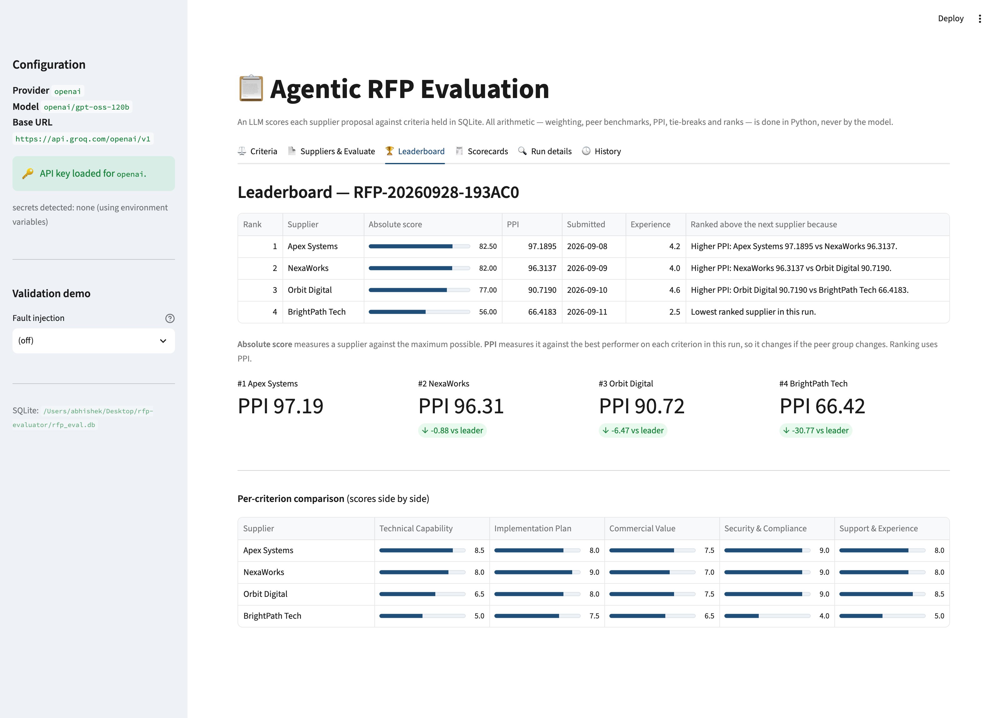
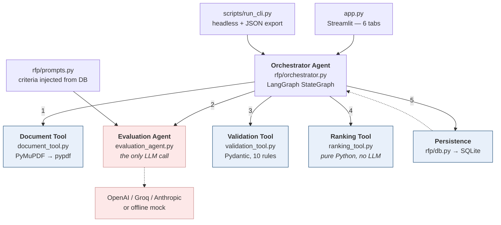
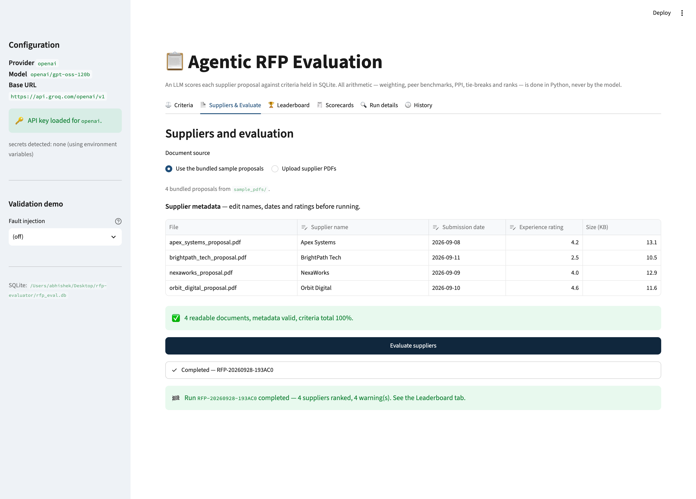
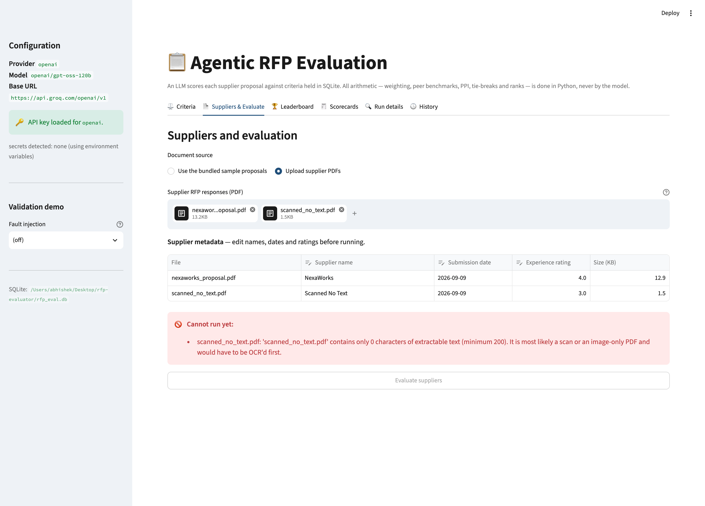
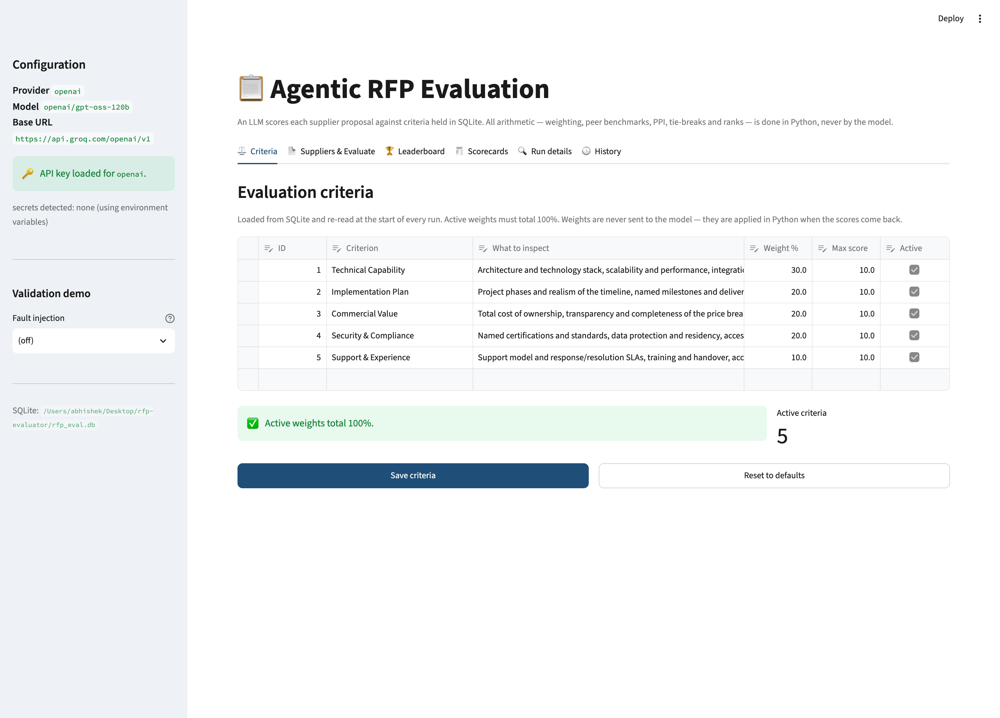
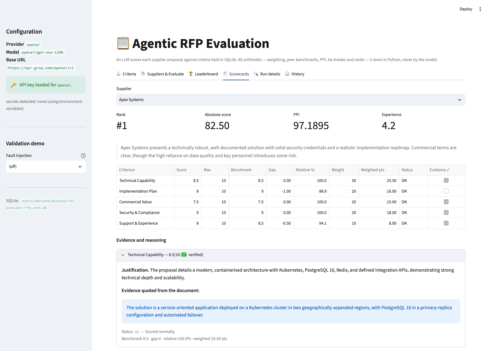
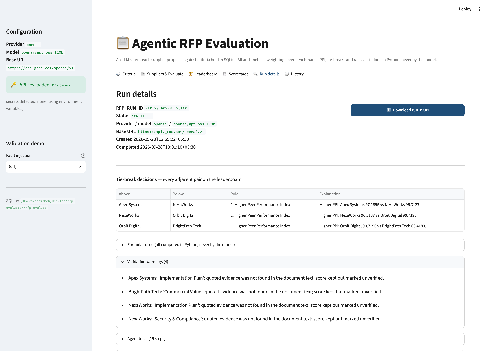

# Agentic RFP Evaluation

A Streamlit application that evaluates supplier responses to a Request for
Proposal. A language model reads each supplier's PDF and scores it against
criteria held in SQLite, quoting the evidence for every score. **Every number
after that point is computed in Python** — weighted scores, peer benchmarks,
the Peer Performance Index, tie-breaks and final ranks. The model is never
asked to do arithmetic and never asked to rank anything.

> **Live app:** _(added at deployment — see [Deployment](#deployment))_



---

## Contents

- [Why the split matters](#why-the-split-matters)
- [Quick start](#quick-start)
- [Architecture](#architecture)
- [How a run works, step by step](#how-a-run-works-step-by-step)
- [Formulas](#formulas)
- [Worked example](#worked-example)
- [Ranking and tie-breaks](#ranking-and-tie-breaks)
- [Validation rules](#validation-rules)
- [Fault injection demo](#fault-injection-demo)
- [Database schema](#database-schema)
- [The scenario and the synthetic suppliers](#the-scenario-and-the-synthetic-suppliers)
- [User interface](#user-interface)
- [Configuration and secrets](#configuration-and-secrets)
- [Testing](#testing)
- [Deployment](#deployment)
- [Assumptions and limitations](#assumptions-and-limitations)
- [Project layout](#project-layout)

---

## Why the split matters

An LLM is good at reading a 4-page proposal and judging whether its security
section is substantive. It is bad at being audited. Ask it to rank four
suppliers and you get a plausible answer you cannot reproduce, cannot explain
to an unsuccessful bidder, and cannot defend if challenged.

So the responsibilities are split down the middle:

| The model decides | Python decides |
|---|---|
| One score per criterion, 0 to max | How much each criterion is worth |
| A short verbatim quote as evidence | Which supplier leads each criterion |
| A justification sentence | Every gap, percentage and index |
| Risks it noticed in the document | Who ranks where, and why |

The model never sees the criterion weights. Telling it that Technical
Capability is worth 30% invites it to inflate scores on whatever it believes
matters most. Weighting is a commercial decision that belongs to the buyer, and
it is applied in `rfp/tools/ranking_tool.py` after the scores come back.

This also answers the obvious objection — *LLM outputs vary, so how is this
deterministic?* Determinism is guaranteed **after validation**. Given the same
validated scores, the ranking is byte-identical every time, in any input order
(`test_ranking_is_independent_of_input_order` proves it across all 24
permutations of four suppliers). And because the complete run document is
stored in SQLite, any past run can be reproduced exactly without re-running the
model.

---

## Quick start

Requires **Python 3.11+** (3.12 recommended — it matches Streamlit Cloud).

```bash
git clone <your-repo-url>
cd rfp-evaluator

python3.12 -m venv .venv
source .venv/bin/activate          # Windows: .venv\Scripts\activate
pip install -r requirements.txt

python scripts/init_db.py              # creates SQLite, seeds 5 criteria
python scripts/generate_sample_pdfs.py # writes 4 proposals + 2 error cases
streamlit run app.py
```

The app opens at <http://localhost:8501>. **No API key is needed to try it** —
it defaults to an offline deterministic scorer. For a real evaluation:

```bash
export LLM_PROVIDER="openai"
export LLM_BASE_URL="https://api.groq.com/openai/v1"
export LLM_MODEL="openai/gpt-oss-120b"
export LLM_API_KEY="gsk_…"          # Windows PowerShell: $env:LLM_API_KEY="gsk_…"
streamlit run app.py
```

> **List the provider's models before choosing one.** Providers retire models
> without notice — `llama-3.3-70b-versatile` was gone by September 2026.
> ```bash
> curl -s https://api.groq.com/openai/v1/models -H "Authorization: Bearer $LLM_API_KEY" \
>   | python3 -c "import sys,json;[print(m['id']) for m in json.load(sys.stdin)['data']]"
> ```

### Command line

```bash
python scripts/run_cli.py --provider mock                    # offline, no key
python scripts/run_cli.py --provider openai \
    --base-url https://api.groq.com/openai/v1 \
    --model openai/gpt-oss-120b \
    --out sample_output/sample_rfp_run.json
python scripts/run_cli.py --provider mock --fault malformed_values --trace
```

---

## Architecture



Red is the only place a model is involved. Everything blue is deterministic.

| Component | File | Responsibility |
|---|---|---|
| Orchestrator Agent | `rfp/orchestrator.py` | LangGraph `StateGraph`: 7 nodes, conditional edges for retry / skip / loop / abort. Emits a live agent trace. |
| Document Tool | `rfp/tools/document_tool.py` | PyMuPDF primary, pypdf fallback. Rejects non-PDF, encrypted and text-free files. Truncates very long documents and flags it. |
| Evaluation Agent | `rfp/agents/evaluation_agent.py` | The single LLM call. Providers: `openai` (with `base_url`, so Groq and OpenRouter work), `anthropic`, and an offline `mock`. |
| Prompts | `rfp/prompts.py` | Builds the criteria block from the database at run time. Weights deliberately excluded. |
| Validation Tool | `rfp/tools/validation_tool.py` | Parses and normalises model output into a strict Pydantic model. Ten repair rules, each leaving a readable warning. |
| Ranking Tool | `rfp/tools/ranking_tool.py` | All formulas and the four-level tie-break. Contains no LLM code of any kind. |
| Persistence | `rfp/db.py`, `sql/schema.sql` | Criteria plus a full run audit trail, written in one transaction. |
| Configuration | `rfp/config.py` | Every setting read from the environment **at call time**, never cached at import. |
| UI | `app.py` | Six tabs, live progress, JSON download, history. |
| CLI | `scripts/run_cli.py` | Headless runs for testing and exports. |

---

## How a run works, step by step

1. **Load criteria** — read active criteria from SQLite and confirm weights
   total 100%. Bad weights abort here, before any token is spent.
2. **Register the run** — write an `rfp_runs` row with status `CREATED`.
3. **Extract the document** — PyMuPDF, falling back to pypdf. A file that is
   not a PDF, is encrypted, or yields under 200 characters is rejected.
4. **Skip or continue** — a rejected document is recorded in `skipped` and the
   run moves to the next supplier rather than failing.
5. **Build the prompt** — criteria injected from the database: id, name, what
   to inspect, score range. No weights.
6. **Call the model** — temperature 0, JSON mode, `max_retries=6` for rate
   limits. Exactly one call per supplier, plus at most one repair retry.
7. **Validate** — parse the JSON out of whatever came back, then normalise it
   against the criteria. Every repair is recorded as a warning.
8. **Retry once if unparseable** — a repair prompt is sent exactly once. Still
   unusable, and the supplier is scored 0 across the board but **stays on the
   leaderboard**, because removing it would change everyone else's benchmark.
9. **Score, benchmark and rank** — in Python: weighted points, absolute score,
   per-criterion benchmarks, gaps, relative percentages, PPI, and one stable
   sort implementing the four tie-break rules.
10. **Persist** — the header row and every supplier row written in a single
    transaction, with the complete run document stored as JSON for replay.

Each step is reported live in the UI as it happens:



---

## Formulas

All implemented in `rfp/tools/ranking_tool.py`.

| Quantity | Definition |
|---|---|
| Weighted points | `score / max_score × weight` |
| Absolute weighted score | `Σ weighted points` — range 0–100 |
| Criterion benchmark | highest validated score for that criterion **across this run** |
| Criterion gap | `score − benchmark` — 0 for the leader, otherwise negative |
| Relative performance % | `score / benchmark × 100` |
| Peer Performance Index (PPI) | `Σ(relative % × weight) / Σ weight` |

**When a benchmark is 0** — meaning no supplier scored anything on that
criterion — the division is undefined. Relative performance is reported as
**0% for every supplier**, the criterion cannot separate anyone, and a run-level
warning is raised. Returning 0 keeps the criterion neutral rather than crashing
or silently dropping it.

**Absolute score and PPI measure different things.** Absolute score compares a
supplier to the maximum possible. PPI compares it to the best performer in this
particular run. A supplier's PPI therefore changes if the peer group changes —
which is exactly why a supplier whose evaluation failed is kept in with zeros
rather than removed.

---

## Worked example

Two criteria: Technical 60%, Price 40%, both scored out of 10.
Supplier A scores (8, 5). Supplier B scores (4, 10).

| | Technical | Price | Absolute | PPI |
|---|---|---|---|---|
| **Benchmark** | 8 | 10 | | |
| **A** score | 8 | 5 | | |
| A weighted points | 8/10 × 60 = 48 | 5/10 × 40 = 20 | **68** | |
| A relative % | 8/8 = 100% | 5/10 = 50% | | **(100×60 + 50×40)/100 = 80** |
| **B** score | 4 | 10 | | |
| B weighted points | 4/10 × 60 = 24 | 10/10 × 40 = 40 | **64** | |
| B relative % | 4/8 = 50% | 10/10 = 100% | | **(50×60 + 100×40)/100 = 70** |

**A ranks first** on PPI 80 vs 70. Note B has the higher raw score on Price and
still loses: it is far behind on the criterion carrying 60% of the weight.

This case is pinned by `test_worked_example_absolute_scores`,
`test_worked_example_ppi_overturns_absolute_score` and
`test_worked_example_benchmarks_and_gaps`.

---

## Ranking and tie-breaks

Suppliers are ordered by **one stable sort**, then assigned ranks 1..N. Rules
are applied in order until one separates the pair:

| # | Rule | Direction |
|---|---|---|
| 1 | Peer Performance Index | higher first |
| 2 | Submission date | earlier first |
| 3 | Historical experience rating | higher first |
| 4 | Supplier name | A → Z |

**PPI is rounded to 4 decimal places before sorting.** Two mathematically equal
indices can differ in the fifteenth decimal place through floating-point
accumulation. Without rounding, that invisible noise decides the rank and the
submission-date rule never fires. `test_ppi_rounded_before_sorting_so_float_noise_cannot_decide`
constructs exactly this case: two suppliers whose true PPI differ by about
1e-10, where the correct outcome is that the earlier submission wins.

Every adjacent pair on the leaderboard records which rule decided it, in plain
English, shown in the UI and stored in the exported JSON:

> PPI tied at 100.0000; Earlier submitted earlier (2026-09-08 vs 2026-09-10).

Each tie-break level has its own test: `test_tiebreak_level_1_ppi` through
`test_tiebreak_level_4_alphabetical`, plus
`test_tiebreak_levels_apply_in_priority_order` to confirm a better date cannot
rescue a supplier that already lost on PPI.

---

## Validation rules

Model output is treated as hostile input. Each repair is deterministic and
leaves a human-readable warning.

| Problem in the model's response | Handling | Status recorded |
|---|---|---|
| Markdown fences or chatter around the JSON | Stripped; first balanced `{…}` parsed | — |
| Unparseable JSON | One repair retry; if still bad, all criteria 0 and the supplier stays visible | `DEFAULTED_PARSE_FAILURE` |
| Score above max, or below 0 | Clipped into range | `CLIPPED` |
| Non-numeric score (`"eight"`, `null`, `true`) | Defaulted to 0 | `DEFAULTED_INVALID` |
| Score written as `"7/10"` or `"7 out of 10"` | Parsed as 7 | `OK` |
| A criterion the model omitted | Added with score 0 | `DEFAULTED_MISSING` |
| Unknown `criterion_id` | Dropped, warning raised | — |
| The same criterion returned twice | First kept, later copy discarded | — |
| `criterion_id` missing but name present | Matched by name | — |
| `max_score` disagrees with the database | Database wins | — |
| Evidence not found in the document text | Score kept, `evidence_verified = false` | unchanged |
| Wrong `supplier_name` | User-entered name used | — |

Evidence matching normalises case and collapses whitespace, so a quote spanning
a line break in the PDF still verifies. Quotes under 12 characters are not
credited — a match that short is luck, not grounding.

### Input validation, before any model call

Checked in the UI, with the Evaluate button disabled until everything passes:
supplier name present and unique · submission date present and not in the
future · experience rating between 0 and 5 · file within the size limit · PDF
actually readable · at least 2 suppliers · active weights total 100% · API key
present for the selected provider.



---

## Fault injection demo

Waiting for a real model to misbehave on camera is not a demo strategy. The
sidebar has a switch that deliberately corrupts **the first supplier's**
response.

| Mode | What it does | Expected result |
|---|---|---|
| `malformed_values` | Injects six defects: score 14, score `"eight"`, a removed criterion, unknown id 99, a duplicate, and markdown fences | **Exactly 5 warnings** — the fences are handled silently |
| `invalid_json_once` | First reply is prose; the repair retry succeeds | Run completes with **0 warnings** |
| `invalid_json_always` | Both attempts return prose | Supplier scores 0, **stays at the bottom of the leaderboard** |

```bash
python scripts/run_cli.py --provider mock --fault malformed_values
```

`invalid_json_always` is the most instructive: when the first supplier drops to
zero, every other supplier's PPI *rises*, because the benchmark it was setting
disappeared with it. `sample_output/sample_validation_case.json` is a stored run
of `malformed_values`.

---

## Database schema

```sql
evaluation_criteria(criterion_id, name, description, weight, max_score, is_active)

rfp_runs(rfp_run_id, created_at, status, completed_at, llm_provider, llm_model,
         supplier_count, criteria_snapshot, warnings_json, run_json)

supplier_results(rfp_run_id, supplier_name, submission_date, experience_rating,
                 absolute_score, ppi, final_rank, result_json)
         PRIMARY KEY (rfp_run_id, supplier_name)
```

`status` is constrained to `CREATED · RUNNING · COMPLETED · FAILED`.
`supplier_results` cascades on delete.

Scalar columns are duplicated out of `result_json` so the leaderboard and
history can be read with plain SQL, while `run_json` holds the complete run
document — criteria snapshot, per-criterion evidence, tie-break explanations,
agent trace and raw model output. That is what makes a historical run
reproducible without calling the model again.

**Seeded criteria** (editable in the UI, must total 100%):

| ID | Criterion | Weight | Max |
|---|---|---|---|
| 1 | Technical Capability | 30% | 10 |
| 2 | Implementation Plan | 20% | 10 |
| 3 | Commercial Value | 20% | 10 |
| 4 | Security & Compliance | 20% | 10 |
| 5 | Support & Experience | 10% | 10 |

Criteria are re-read from the database at the start of every run, so an edit
takes effect immediately — no restart, no cache to clear.



---

## The scenario and the synthetic suppliers

> **All of this is fictional**, written for an academic exercise. No real
> organisation is described.

**Greenfield City Library Service** (ref `GCLS/RFP/2026/014`) runs a central
library and eleven branches serving 184,000 members. Its library management
system dates from 2006, is unsupported, and cannot handle self-service
borrowing, online renewals, or consolidated reporting. It is procuring a
replacement covering catalogue, membership, circulation, inter-branch
transfers, fines and public search.

Four proposals were written with deliberately different strengths, so the
evaluation has something real to discriminate between:

| Supplier | Designed profile | 3-year TCO | Submitted | Experience |
|---|---|---|---|---|
| **Apex Systems** | Strongest technical design and security — ISO 27001 + SOC 2, two-region Kubernetes, three migration rehearsals. Most expensive, moderate schedule. | $629,000 | 2026-09-08 | 4.2 |
| **NexaWorks** | Balanced. Strongest implementation plan and support model — staged pilot rollout, RACI, contingency buffer, SLAs matching library opening hours. | $486,000 | 2026-09-09 | 4.0 |
| **Orbit Digital** | Strongest track record — 61 prior deployments, four referenceable sites. **Integration plan deliberately vague.** | $454,000 | 2026-09-10 | 4.6 |
| **BrightPath Tech** | Cheapest and fastest — 16 weeks. **Weak compliance detail** (no certification held), limited experience, no SSO at launch. | $288,000 | 2026-09-11 | 2.5 |

Content lives in `scripts/supplier_content.py` as plain data; rendering is
`scripts/generate_sample_pdfs.py`. **Price totals are computed from line items,
never typed**, and the generator asserts the printed total appears in the
extracted text — a price table cannot disagree with its own sum.

Two deliberately broken files in `sample_pdfs/error_cases/` exercise the
rejection paths: `scanned_no_text.pdf` (valid PDF, drawn shapes only, no text
layer) and `not_a_pdf.pdf` (a text file wearing a `.pdf` extension).

**Does it work?** Running `openai/gpt-oss-120b` against these documents, the
model independently identified both planted weaknesses — it scored BrightPath
lowest on Security & Compliance, citing *"ISO 27001 is only planned"*, and
scored Orbit lowest on Technical Capability for *"limited detail on
scalability"*, while flagging its integration allowance as a commercial risk.

---

## User interface

| Tab | Contents |
|---|---|
| ⚖️ Criteria | Editable criteria table, live weight total, save and reset |
| 📄 Suppliers & Evaluate | Bundled proposals or upload, editable metadata, validation messages, live agent trace |
| 🏆 Leaderboard | Ranks, absolute score, PPI, tie-break reason, per-criterion comparison |
| 🧾 Scorecards | Per criterion: score, benchmark, gap, relative %, weighted points, status, evidence verified — with expandable evidence |
| 🔍 Run details | Run id, model, tie-break table, formulas, warnings, agent trace, raw model output, stored SQLite rows, **JSON download** |
| 🕓 History | Past runs from SQLite, reloadable |




---

## Configuration and secrets

| Variable | Purpose | Default |
|---|---|---|
| `LLM_PROVIDER` | `openai`, `anthropic` or `mock` | `mock` |
| `LLM_MODEL` | Model id — list the provider's `/models` first | — |
| `LLM_BASE_URL` | Set for Groq / OpenRouter; unset for OpenAI proper | — |
| `LLM_API_KEY` | Generic key; `OPENAI_API_KEY` / `ANTHROPIC_API_KEY` also accepted | — |
| `RFP_DB_PATH` | Override the SQLite location | `rfp_eval.db` |

Two deliberate choices, both of which exist because the obvious approach fails
in deployment:

1. **Settings are read at call time, never at import.** Streamlit Cloud injects
   `st.secrets` after the module graph is imported, so a module-level
   `PROVIDER = os.getenv(...)` freezes the placeholder and the deployed app
   reports "no API key" forever, no matter what you save.
2. **The sidebar lists the secret *names* it found**, never values. When a
   deployment misbehaves, that one caption tells you instantly whether the
   secrets arrived. A test asserts it can never contain `gsk_` or `sk-`.

`.streamlit/secrets.toml` is gitignored. Copy `.streamlit/secrets.toml.example`
to create it, and never commit a real key.

---

## Testing

```bash
pytest -q          # 147 passed
```

| File | Tests | Covers |
|---|---|---|
| `test_validation_tool.py` | 41 | Every normalisation rule, JSON recovery, evidence verification |
| `test_ranking_tool.py` | 29 | Formulas, worked example, each tie-break level, order independence |
| `test_evaluation_agent.py` | 28 | Prompt construction, offline scorer, provider guards, fault injection |
| `test_db.py` | 16 | Criteria rules, weight guard and rollback, atomic run writes |
| `test_orchestrator.py` | 13 | Full pipeline, skip, retry, fault modes, persistence |
| `test_document_tool.py` | 11 | Extraction and all rejection paths |
| `test_app.py` | 9 | The real Streamlit app, headless, including a full run |

The UI tests use Streamlit's own `AppTest` harness — they execute `app.py` end
to end with no browser. They exist because a UI fault is invisible to unit
tests and only shows up as a blank screen in front of whoever is marking the
work. One such fault was caught this way: the leaderboard heatmap used
`pandas.Styler.background_gradient`, which silently requires matplotlib and
would have crashed the deployed app on a dependency that was never declared.

Screenshots are regenerated with `python scripts/capture_screenshots.py`
against a running app. Playwright is a development tool and is deliberately
**not** in `requirements.txt`.

---

## Deployment

Deployed on Streamlit Community Cloud.

1. Push to GitHub. **Check nothing sensitive is staged first:**
   ```bash
   git status --short | grep -E "secrets.toml|\.db$|\.venv" && echo STOP || echo clean
   ```
2. <https://share.streamlit.io> → **Create app** → your repo, branch `main`,
   file `app.py`.
3. **Advanced settings → Python 3.12** (match your local version).
4. **Secrets** — paste, using straight quotes and no trailing spaces:
   ```toml
   LLM_PROVIDER = "openai"
   LLM_BASE_URL = "https://api.groq.com/openai/v1"
   LLM_MODEL    = "openai/gpt-oss-120b"
   LLM_API_KEY  = "gsk_…"
   ```
5. Save, then **Manage app → ⋮ → Reboot**. Confirm the sidebar reads
   `secrets detected: LLM_PROVIDER, LLM_MODEL, LLM_BASE_URL, LLM_API_KEY`.

### Troubleshooting

| Symptom | Cause | Fix |
|---|---|---|
| Sidebar shows defaults, "no API key" | Secrets not saved, or read once at import | Save secrets, then reboot the app |
| `401 invalid_api_key` | Revoked or mis-pasted key | New key; straight quotes, no spaces. Test: `curl … -w "%{http_code}"` → 200 |
| `404 model_not_found` | Provider retired the model | List `/models`, pick a current one |
| `429 rate limit` | Free-tier quota | Wait, or switch to `LLM_PROVIDER = "mock"` |
| `git push` rejected | Streamlit Cloud added `.devcontainer` | `git pull --rebase origin main && git push` |
| App asleep | Free tier sleeps when idle | Open it once before it is needed |

---

## Assumptions and limitations

1. **Proposals are text-based PDFs.** Scanned documents are rejected rather
   than OCR'd — scoring a document the model cannot actually read would produce
   confident nonsense. Adding OCR would be the natural next step.
2. **At least two suppliers.** Peer benchmarks are meaningless with one.
3. **Benchmarks are relative to the run, not to history.** Adding or removing a
   supplier changes every other supplier's PPI. This is intended: the question
   is who is best among *these* bids.
4. **Experience rating is supplied by the user**, not derived from the
   document. It is buyer knowledge, so the model is not asked to guess it.
5. **Documents over 40,000 characters are truncated** and the run warns. Nothing
   beyond that point is seen by the model.
6. **One model call per supplier**, plus at most one repair retry. Deliberate:
   more retries at temperature 0 mostly re-send the same prompt and get the
   same failure, while burning quota.
7. **Score granularity is the model's.** It may return halves; validation
   accepts any number in range rather than forcing integers.
8. **No authentication.** It is a single-user evaluation tool, not a
   procurement portal.
9. **Evidence verification is exact-substring after normalisation.** A model
   that paraphrases a real fact is marked unverified even though it is not
   wrong. Preferred over fuzzy matching, which would quietly accept invention.
10. **The offline mock provider counts keywords.** It is a plumbing test, not a
    judge — it cannot detect vagueness, which is precisely what distinguishes a
    weak proposal. Use a real model for real conclusions.

---

## Project layout

```
rfp-evaluator/
├── app.py                          Streamlit UI, 6 tabs
├── requirements.txt
├── README.md
├── rfp/
│   ├── config.py                   env read at call time, never at import
│   ├── db.py                       SQLite: criteria + run audit trail
│   ├── orchestrator.py             LangGraph StateGraph, 7 nodes
│   ├── prompts.py                  criteria injected from the database
│   ├── samples.py                  bundled proposal metadata
│   ├── agents/
│   │   └── evaluation_agent.py     the only LLM call + offline mock
│   └── tools/
│       ├── document_tool.py        PyMuPDF → pypdf, rejection rules
│       ├── validation_tool.py      10 normalisation rules → Pydantic
│       └── ranking_tool.py         all formulas + tie-breaks, no LLM
├── sql/schema.sql                  3 tables
├── scripts/
│   ├── init_db.py                  create + seed
│   ├── supplier_content.py         proposal text (plain data, editable)
│   ├── generate_sample_pdfs.py     reportlab renderer, computed totals
│   ├── run_cli.py                  headless run + JSON export
│   └── capture_screenshots.py      Playwright, dev only
├── sample_pdfs/                    4 proposals
│   └── error_cases/                scanned + not-a-PDF
├── sample_output/                  exported run JSON
├── docs/screenshots/               6 screenshots
└── tests/                          147 tests
```

---

*Built as an individual mini project. The buyer, the suppliers, the proposals
and every reference in them are fictional.*
